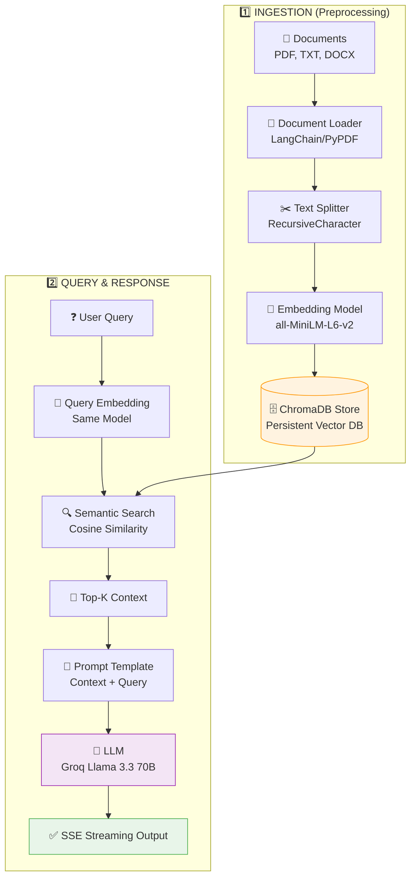

# 🎯 RAG Chatbot - Exhaustive Interview Preparation Guide

This document is your definitive "A-to-Z" master guide for technical interviews. It covers every line of code, architectural decision, and potential technical question for your LLM-Powered RAG Chatbot.

---

## 📌 Table of Contents

1.  [What is RAG? (The Core Concept)](#what-is-rag)
2.  [High-Level Architecture](#high-level-architecture)
3.  [Complete Data Flow (Visualized)](#complete-data-flow)
4.  [Component Deep Dive (Code Level)](#component-deep-dive)
5.  [Hardware & Speed (Groq LPU)](#hardware--speed)
6.  [Advanced Engineering Features](#advanced-features)
7.  [Key Technologies Explained](#key-technologies)
8.  [Exhaustive Interview Q&A (40+ Questions)](#interview-qa)
9.  [Final Takeaways & Cheat Sheet](#cheat-sheet)

---

## What is RAG?

**RAG (Retrieval-Augmented Generation)** is a technique that enhances Large Language Models (LLMs) by providing them with relevant context from external documents before generating responses.

### Why RAG?

| Problem with Pure LLMs | How Your Project Solves It |
| :--- | :--- |
| **Limited Training Data** | Your bot reads private resumes, PDFs, and docs. |
| **Knowledge Cutoff** | Uses real-time data uploaded 5 seconds ago. |
| **Hallucinations** | Grounded in facts. If it's not in the PDF, the bot says "I don't know." |
| **Data Privacy** | Sensitive files stay in your persistent ChromaDB store. |

### The RAG Formula
```text
RAG Output = LLM(User Query + Retrieved Context Chunks + System Instructions)
```

---

## High-Level Architecture



---

## Complete Data Flow

### Phase 1: Document Ingestion (One-time setup)

```text
┌─────────────────────────────────────────────────────────────────────────┐
│  STEP 1: LOAD DOCUMENTS                                                 │
│  File: src/data_loader.py                                               │
│                                                                         │
│  Loads binary files (PDF/DOCX) and converts them to LangChain Documents. │
│  Structure: { text: "...", metadata: { source: "resume.pdf" } }         │
└─────────────────────────────────────────────────────────────────────────┘
                                    │
                                    ▼
┌─────────────────────────────────────────────────────────────────────────┐
│  STEP 2: CHUNK & OVERLAP                                                │
│  RecursiveCharacterTextSplitter                                         │
│  ├── chunk_size: 1000 chars                                             │
│  ├── chunk_overlap: 200 chars                                           │
│  └── Logic: Splits by paragraphs first, then sentences, then words.     │
└─────────────────────────────────────────────────────────────────────────┘
                                    │
                                    ▼
┌─────────────────────────────────────────────────────────────────────────┐
│  STEP 3: CONTENT-BASED HASHING                                          │
│  File: src/vectorstore.py                                               │
│                                                                         │
│  ID = MD5(filename + chunk_content)                                     │
│  ├── Prevents duplicate vectors if same file uploaded 10 times.         │
│  └── Ensures idempotency in the Vector Database.                        │
└─────────────────────────────────────────────────────────────────────────┘
                                    │
                                    ▼
┌─────────────────────────────────────────────────────────────────────────┐
│  STEP 4: GENERATE EMBEDDINGS (Vectors)                                  │
│  Model: all-MiniLM-L6-v2                                                │
│  ├── Output: 384-dimensional floating point vectors.                    │
│  └── Meaning: Numbers represent semantic relationships in vector space.  │
└─────────────────────────────────────────────────────────────────────────┘
                                    │
                                    ▼
┌─────────────────────────────────────────────────────────────────────────┐
│  STEP 5: PERSIST TO CHROMADB                                            │
│  ├── Client: PersistentClient('chroma_store/')                          │
│  └── Storage: Files remain on disk even if server restarts.             │
└─────────────────────────────────────────────────────────────────────────┘
```

### Phase 2: Query Processing (Every user message)

```text
┌──────────────────────────────────────────────────────┐
│  STEP 1: USER ASKS A QUESTION                        │
│  "What are the candidate's Python skills?"            │
└──────────────────────────────────────────────────────┘
                          │
                          ▼
┌──────────────────────────────────────────────────────┐
│  STEP 2: EMBED QUERY                                 │
│  Query is converted to a 384-dim vector using the    │
│  SAME embedding model used for the documents.        │
└──────────────────────────────────────────────────────┘
                          │
                          ▼
┌──────────────────────────────────────────────────────┐
│  STEP 3: SEARCH CHROMADB                             │
│  Uses Cosine Similarity to find chunks where the     │
│  vector "Math" matches the query "Math".             │
└──────────────────────────────────────────────────────┘
                          │
                          ▼
┌──────────────────────────────────────────────────────┐
│  STEP 4: PROMPT GENERATION (The Augmentation)        │
│  "Answer based ONLY on these chunks: [Chunk 1, 2]"   │
└──────────────────────────────────────────────────────┘
                          │
                          ▼
┌──────────────────────────────────────────────────────┐
│  STEP 5: INFERENCE & STREAMING                       │
│  Groq API streams tokens character-by-character.      │
│  FastAPI uses StreamingResponse (SSE).               │
└──────────────────────────────────────────────────────┘
```

---

## Component Deep Dive

### 1. The Vector Store (ChromaDB)
- **Why ChromaDB?** Native persistence. Unlike FAISS, which requires manual `.save()` / `.load()` of indices and separate text pickles, ChromaDB handles the vector + text + metadata as one atomic unit.
- **Deduplication**: We implemented a `_generate_doc_id` method. In an interview, explain how this saves memory and increases retrieval precision.

### 2. The Embedding Engine
- **Model**: `all-MiniLM-L6-v2`.
- **Logic**: It's a "Siamese BERT" architecture. It creates a "sentence embedding" where the vector represents the concept of the sentence, not just word frequencies (TF-IDF).

### 3. The Backend (FastAPI)
- **Performance**: We use `async/await` to handle streaming.
- **Lifespan**: We pre-load the model at startup to prevent "cold start" latency.

---

## Hardware & Speed (Groq LPU)

**Critical Interview Talking Point**: Why is your bot so fast?
- **Standard GPUs**: Designed for graphics; they process many tasks in parallel but have high memory latency for "next token" prediction.
- **Groq LPUs (Language Processing Units)**: Designed specifically for the **sequential** nature of LLMs. 
- **The Result**: 500+ tokens per second. Your RAG system feels like a real-time conversation rather than waiting for a "thinking" bubble.

---

## Advanced Engineering Features

### 1. Server-Sent Events (SSE)
- We opted for SSE over WebSockets. 
- **Reason**: SSE is unidirectional, lightweight, and supports automatic reconnection. It's the industry standard for LLM streaming (used by OpenAI).

### 2. Overlap Chunking
- **Why 200 overlap?** If Chunk A ends with "The capital of France is" and Chunk B starts with "Paris," neither chunk is useful alone. Overlap ensures "Paris" appears in both contexts.

---

## Key Technologies Explained

### LangChain
- **Purpose**: The "Orchestrator." It connects the loader to the splitter, and the splitter to the embedding model.
- **Usage**: We use `RecursiveCharacterTextSplitter` as it's smarter than a standard fixed-length splitter; it respects paragraph and sentence boundaries.

### Transformer Math (Simplified)
- **Attention Mechanism**: The LLM uses "Self-Attention" to decide which words in your documents are most important to the query.
- **Temperature (0.1)**: We keep it low to make the bot "factual." High temp (0.9) makes the bot creative and "hallucination-prone."

---

## Exhaustive Interview Q&A

### 🧱 Basic Questions

**Q1: What is the main difference between RAG and Fine-tuning?**
> RAG provides external knowledge at "inference time" (real-time). Fine-tuning physically structuralizes knowledge into the model's weights during training. RAG is better for dynamic data (docs that change daily) and is much cheaper.

**Q2: What is an Embedding?**
> An embedding is a numerical representation of a piece of text. In my project, it's a list of 384 numbers. These numbers represent the "semantic coordinates" of that text in a high-dimensional space where similar meanings are geographically close together.

**Q3: Why did you use FastAPI?**
> FastAPI is high-performance, asynchronous-native, and uses Pydantic for automatic data validation. For a streaming application like a chatbot, its support for `StreamingResponse` is vital.

---

### ⚙️ Technical Questions

**Q4: Explain the importance of `chunk_size` and `chunk_overlap`.**
> `chunk_size` (1000) ensures pieces are small enough for the embedding model's token limit but large enough to contain a complete thought. `chunk_overlap` (200) ensures that context isn't lost at the boundaries, preventing the "cutting sentences in half" problem.

**Q5: How does Cosine Similarity work?**
> It measures the angle between two vectors. If the angle is 0, the vectors point in the same direction (identical meaning). Unlike Euclidean distance, it focuses on the "orientation" of the meaning rather than the "magnitude" of the words.

**Q6: What is a Vector Database?**
> A database specialized in storing and searching vectors. Unlike SQL which searches for exact matches (`WHERE name='John'`), a Vector DB searches for "nearest neighbors" (`Find top 3 closest to this meaning`).

---

### 🚀 Advanced Questions (Architectural Thinking)

**Q7: How would you handle a PDF that is purely images (scanned documents)?**
> I would integrate an **OCR (Optical Character Recognition)** engine like `Tesseract` or `PyMuPDF` with OCR support into my `data_loader.py`. This would extract the text from the images before passing it to the chunker.

**Q8: Scale to 1,000,000 documents. What changes?**
> 1. Move from local ChromaDB to a managed cloud store like **Pinecone** or **Milvus**.
> 2. Implement **Sharding**: Splitting the database across multiple servers.
> 3. Use **Asynchronous Workers**: Handling ingestion in the background using `Celery` or `RabbitMQ` so the UI doesn't freeze.

**Q9: How do you prevent the LLM from accessing another user's documents?**
> This requires **Metadata Filtering**. I would store a `user_id` in the metadata of every document chunk. When searching, I'd apply a filter: `where={"user_id": current_logged_in_user}`. ChromaDB handles this at the storage level.

**Q10: What is your strategy for handling LLM hallucinations?**
> 1. Set **Temperature to 0** (or 0.1) for deterministic output.
> 2. **Explicit Prompting**: "Answer strictly based on the provided context."
> 3. **Verification**: Show the user the sources (chunks) used to generate the answer so they can verify.

---

### 🤖 LLM & Prompt Questions

**Q11: Why Llama 3.3 70B over GPT-4?**
> Llama 3.3 70B is an open-weights model that provides GPT-4 level performance but allows for more control. When combined with Groq's LPU, it offers a level of speed that closed-source APIs can't match.

**Q12: Explain your Prompt Template.**
> I use a "Contextual Constraint" prompt. It includes a specific instruction block, followed by the retrieved text chunks, and finally the user query. This structure forces the model to prioritize the context over its own pre-trained knowledge.

---

### 🛡️ Debugging & Behavioral

**Q13: Describe a difficult bug you faced.**
> "I noticed that uploading the same file twice created duplicate results. I solved this by implementing an MD5 hashing layer. Now, every chunk gets a deterministic ID based on its content. This not only deduplicates but also makes the ingestion process idempotent."

**Q14: What would you improve if given 1 more month?**
> I would implement **Hybrid Search** (combining Vector Search with Keyword Search) to handle edge cases where people search for specific product IDs or names that embeddings might "blur" together. I'd also add **Re-ranking** using a Cross-Encoder to refine the final top-K results.

---

## 🏁 Cheat Sheet: Quick Reference Card

| Component | Choice | Key Numbers |
| :--- | :--- | :--- |
| **Backend** | FastAPI | Async/Await Support |
| **Frontend** | React + Vite | Streaming Handler |
| **Vector DB** | ChromaDB | Persistent Store |
| **Embeddings** | all-MiniLM-L6-v2 | 384 Dimensions |
| **LLM Inference** | Groq (LPU) | 500+ tokens/sec |
| **Chunking** | Recursive | 1000/200 Overlap |

---

## 🎓 Key Takeaways for Success

1.  **Trace the Flow**: Be ready to explain exactly how one word in a PDF becomes a chunk, then a vector, then a matching database result, and finally an answer.
2.  **Tradeoffs are King**: Always explain *why* you chose one tech over another (e.g., ChromaDB vs. FAISS).
3.  **Deduplication & Performance**: Mentioning MD5 hashing and Warm-up models shows you think like a software engineer, not just an AI tinkerer.

---

**Good luck! You now have a 700-line master guide to conquer your interview.** 🚀
