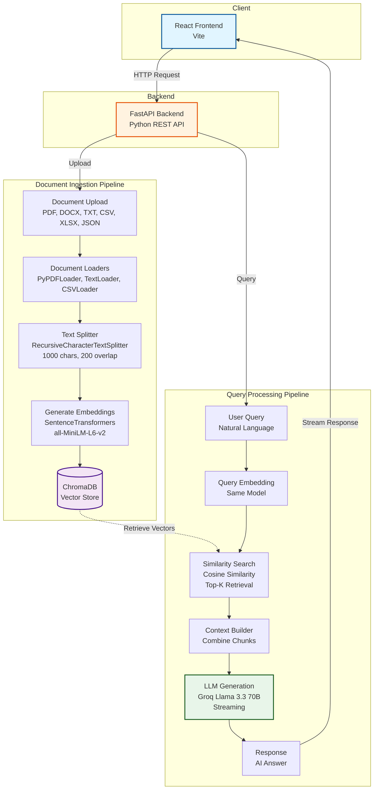

# LLM-Powered RAG ChatBot

A modern document-based question-answering chatbot powered by **Retrieval-Augmented Generation (RAG)**, **FastAPI**, and **React**. Upload your documents and have intelligent conversations with them using advanced AI.

---

## Table of Contents

- [Features](#features)
- [What is RAG?](#what-is-rag)
- [Architecture](#architecture)
- [Tech Stack](#tech-stack)
- [How It Works](#how-it-works)
- [Installation](#installation)
- [Usage](#usage)
- [API Endpoints](#api-endpoints)
- [Configuration](#configuration)
- [Project Structure](#project-structure)
- [License](#license)

---

## Features

- **Multi-Format Document Support** - Upload PDF, TXT, DOCX, CSV, XLSX, and JSON files
- **Intelligent Semantic Search** - ChromaDB vector database for accurate document retrieval
- **Real-time Streaming Responses** - ChatGPT-style streaming for better user experience
- **Modern Chat Interface** - React-based UI with Vite for fast development
- **REST API** - FastAPI backend with comprehensive endpoints
- **Context-Aware Answers** - AI responds based on your uploaded documents
- **Persistent Storage** - ChromaDB maintains your document embeddings across sessions

---

## What is RAG?

**Retrieval-Augmented Generation (RAG)** is a technique that enhances Large Language Models (LLMs) by giving them access to external knowledge. Instead of relying solely on the model's training data, RAG:

1. **Retrieves** relevant information from your documents
2. **Augments** the LLM's prompt with this retrieved context
3. **Generates** accurate, context-aware responses

### Why RAG?

- **Reduces hallucinations** - Answers are grounded in your actual documents
- **Up-to-date information** - Works with your latest documents without retraining
- **Domain-specific knowledge** - Enables the LLM to answer questions about your documents
- **Verifiable sources** - Responses are based on retrievable document chunks
- **Cost-effective** - No need for expensive model fine-tuning

---

## Architecture



### System Flow

**Document Ingestion (Left Pipeline):**
1. User uploads documents through React interface
2. FastAPI receives files and routes to document loaders
3. Appropriate loader parses each file type
4. Text is split into chunks (1000 chars with 200 overlap)
5. Each chunk is converted to 384-dimensional vectors
6. Vectors stored in ChromaDB with metadata

**Query Processing (Right Pipeline):**
1. User asks a question through chat interface
2. Question is converted to vector using same embedding model
3. ChromaDB performs similarity search to find relevant chunks
4. Top-K most similar chunks are retrieved
5. Context is built from retrieved chunks
6. Groq LLM generates answer based on context
7. Response is streamed back to user in real-time

---

## Tech Stack

### Backend

| Component | Technology | Purpose |
|-----------|------------|---------|
| **Web Framework** | FastAPI | High-performance async API server |
| **LLM Provider** | Groq API | Ultra-fast inference with Llama 3.3 70B |
| **Vector Database** | ChromaDB | Persistent vector storage and similarity search |
| **Embeddings** | Sentence Transformers | Convert text to 384-dim vectors |
| **Document Processing** | LangChain Community | Parse PDF, DOCX, CSV, XLSX, JSON |
| **Text Splitting** | LangChain | Recursive character text splitter |

### Frontend

| Component | Technology | Purpose |
|-----------|------------|---------|
| **UI Framework** | React | Component-based user interface |
| **Build Tool** | Vite | Fast development and optimized builds |
| **Styling** | CSS | Custom ChatGPT-style interface |
| **HTTP Client** | Fetch API | Communicate with FastAPI backend |

---

## How It Works

### Document Processing

**Step 1: Upload Documents**
- Supported formats: PDF, DOCX, TXT, CSV, XLSX, JSON
- Files sent to `/api/upload` endpoint
- Server saves files temporarily for processing

**Step 2: Parse & Extract Text**
- **PDF**: PyPDFLoader extracts text from each page
- **DOCX**: Docx2txtLoader parses Word documents
- **TXT**: TextLoader reads plain text
- **CSV**: CSVLoader processes tabular data
- **XLSX**: Custom pandas-based loader for Excel files
- **JSON**: JSONLoader handles structured data

**Step 3: Split into Chunks**
- RecursiveCharacterTextSplitter divides text
- Chunk size: 1000 characters (optimal for embeddings)
- Overlap: 200 characters (preserves context)
- Ensures chunks fit within model limits

**Step 4: Generate Embeddings**
- Model: `sentence-transformers/all-MiniLM-L6-v2`
- Each chunk → 384-dimensional vector
- Captures semantic meaning, not just keywords
- Fast CPU inference

**Step 5: Store in ChromaDB**
- Vectors stored with metadata (filename, chunk index)
- Persisted to disk in `chroma_store/` directory
- Indexed for fast similarity search

### Query Processing

**Step 1: User Question**
- Question typed in React chat interface
- Sent to `/api/chat/stream` for streaming response

**Step 2: Embed Query**
- Same embedding model converts query to vector
- Ensures query and documents are in same semantic space

**Step 3: Similarity Search**
- ChromaDB compares query vector with stored vectors
- Uses cosine similarity (range: -1 to 1)
- Returns top-k most similar chunks (default k=4)

**Step 4: Build Context**
- Retrieved chunks concatenated with separators
- Format: `Context: [Chunk 1] --- [Chunk 2] --- [Chunk 3]`

**Step 5: LLM Generation**
- System prompt instructs LLM to use only provided context
- Groq's Llama 3.3 70B generates answer
- Temperature: 0.7 (balanced creativity/accuracy)
- Response streamed token-by-token via Server-Sent Events

**Step 6: Display Response**
- React component receives streaming chunks
- UI updates in real-time (typing effect)
- User sees answer appearing progressively

---

## Installation

### Prerequisites

- Python 3.8 or higher
- Node.js 16.x or higher
- npm 8.x or higher
- Groq API Key ([Get one free](https://console.groq.com))

### Backend Setup

```bash
# Clone the repository
git clone https://github.com/RupeshSiddani/LLM-Powered-RAG-ChatBot.git
cd LLM-Powered-RAG-ChatBot

# Create virtual environment
python -m venv venv

# Activate virtual environment
# Windows:
venv\Scripts\activate
# macOS/Linux:
source venv/bin/activate

# Install dependencies
pip install fastapi uvicorn python-multipart python-dotenv \
            langchain langchain-groq langchain-community \
            sentence-transformers chromadb pypdf python-docx \
            pandas openpyxl
```

### Frontend Setup

```bash
# Navigate to frontend directory
cd frontend

# Install dependencies
npm install

# Return to project root
cd ..
```

### Environment Configuration

Create `.env` file in project root:

```env
# Required
GROQ_API_KEY=your_groq_api_key_here

# Optional (defaults shown)
EMBEDDING_MODEL=all-MiniLM-L6-v2
LLM_MODEL=llama-3.3-70b-versatile
PERSIST_DIR=chroma_store
CHUNK_SIZE=1000
CHUNK_OVERLAP=200
```

---

## Usage

### Start the Application

**Terminal 1 - Backend:**
```bash
python main_api.py
```
Server runs at `http://localhost:8000`

**Terminal 2 - Frontend:**
```bash
cd frontend
npm run dev
```
UI available at `http://localhost:5173`

### Using the ChatBot

1. Open `http://localhost:5173` in your browser
2. Click "Upload Documents" and select files
3. Wait for processing confirmation
4. Type questions in the chat input
5. View AI responses based on your documents

---

## API Endpoints

### Health Check
```http
GET /api/health
```
Response: `{"status": "healthy"}`

### Upload Documents
```http
POST /api/upload
Content-Type: multipart/form-data

Request: files: [File, File, ...]
Response: {"message": "Documents uploaded successfully", "files_processed": 3}
```

### Chat (Non-Streaming)
```http
POST /api/chat
Content-Type: application/json

Request: {"message": "What is the main topic?"}
Response: {"response": "Based on the documents..."}
```

### Chat (Streaming)
```http
POST /api/chat/stream
Content-Type: application/json

Request: {"message": "Summarize the document"}
Response: Server-Sent Events stream
```

---

## Configuration

### Embedding Models

```env
# Default (384-dim, balanced)
EMBEDDING_MODEL=all-MiniLM-L6-v2

# Higher accuracy (768-dim, slower)
EMBEDDING_MODEL=all-mpnet-base-v2

# Multilingual support
EMBEDDING_MODEL=paraphrase-multilingual-MiniLM-L12-v2
```

### LLM Models

```env
# Default - Fast and versatile
LLM_MODEL=llama-3.3-70b-versatile

# Alternatives
LLM_MODEL=llama-3.1-70b-versatile
LLM_MODEL=mixtral-8x7b-32768
```

### Chunking Parameters

```env
# Larger chunks = more context, slower
CHUNK_SIZE=1500
CHUNK_OVERLAP=300

# Smaller chunks = less context, faster
CHUNK_SIZE=500
CHUNK_OVERLAP=100
```

---

## Project Structure

```
LLM-Powered-RAG-ChatBot/
│
├── main_api.py                 # FastAPI application
├── requirements.txt            # Python dependencies
├── .env                        # Environment variables
├── .gitignore                  # Git ignore rules
├── README.md                   # Documentation
│
├── src/
│   ├── __init__.py
│   ├── vectorstore.py          # ChromaDB operations
│   ├── search.py               # RAG search logic
│   ├── embedding.py            # Embedding pipeline
│   └── data_loader.py          # Document parsing
│
├── frontend/
│   ├── package.json            # Node dependencies
│   ├── vite.config.js          # Vite config
│   ├── index.html              # HTML entry
│   │
│   └── src/
│       ├── App.jsx             # Main React component
│       ├── App.css             # Styling
│       └── main.jsx            # React entry
│
└── chroma_store/               # Vector database (auto-created)
```

---

## Troubleshooting

### Backend Issues

```bash
# Port already in use
uvicorn main_api:app --port 8001

# Module not found
pip install -r requirements.txt
```

### Frontend Issues

```bash
# Clear cache and reinstall
rm -rf node_modules package-lock.json
npm install
```

### Embedding Issues

```bash
# Model download (first run takes time)
# Solution: Wait for automatic download

# Out of memory
# Solution: Use smaller embedding model
```

### ChromaDB Issues

```bash
# Reset database
rm -rf chroma_store/
python main_api.py
```

---

## Contributing

Contributions welcome! Please:

1. Fork the repository
2. Create feature branch (`git checkout -b feature/NewFeature`)
3. Commit changes (`git commit -m 'Add NewFeature'`)
4. Push to branch (`git push origin feature/NewFeature`)
5. Open Pull Request

---

## License

MIT License

Copyright (c) 2025

Permission is hereby granted, free of charge, to any person obtaining a copy
of this software and associated documentation files (the "Software"), to deal
in the Software without restriction, including without limitation the rights
to use, copy, modify, merge, publish, distribute, sublicense, and/or sell
copies of the Software, and to permit persons to whom the Software is
furnished to do so, subject to the following conditions:

The above copyright notice and this permission notice shall be included in all
copies or substantial portions of the Software.

THE SOFTWARE IS PROVIDED "AS IS", WITHOUT WARRANTY OF ANY KIND, EXPRESS OR
IMPLIED, INCLUDING BUT NOT LIMITED TO THE WARRANTIES OF MERCHANTABILITY,
FITNESS FOR A PARTICULAR PURPOSE AND NONINFRINGEMENT. IN NO EVENT SHALL THE
AUTHORS OR COPYRIGHT HOLDERS BE LIABLE FOR ANY CLAIM, DAMAGES OR OTHER
LIABILITY, WHETHER IN AN ACTION OF CONTRACT, TORT OR OTHERWISE, ARISING FROM,
OUT OF OR IN CONNECTION WITH THE SOFTWARE OR THE USE OR OTHER DEALINGS IN THE
SOFTWARE.

---

## Acknowledgments

- [FastAPI](https://fastapi.tiangolo.com/) - Web framework
- [LangChain](https://python.langchain.com/) - RAG framework
- [ChromaDB](https://www.trychroma.com/) - Vector database
- [Sentence Transformers](https://www.sbert.net/) - Embeddings
- [Groq](https://groq.com/) - LLM inference
- [React](https://react.dev/) - Frontend framework
- [Vite](https://vitejs.dev/) - Build tool

---

**Built with FastAPI, React, and ChromaDB**